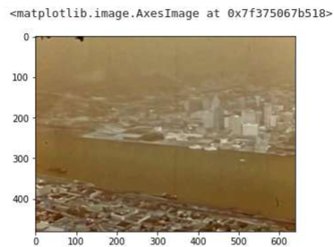

# Coursera: OpenCV and NumPy
My progress through the guided, introductory projects provided by Coursera using OpenCV and NumPy

## Project 1 - [Analyzing Video with OpenCV and Numpy](https://www.coursera.org/projects/analyzing-video-opencv-numpy)
### Task 1: Define a Generator for Reading a Video
```python
def get_frames(filename):
    video = cv2.VideoCapture(filename)
    while video.isOpened():
        retrieved, frame = video.read() # Obtain video frame and whether or not successfully retrieved
        if retrieved:
            yield frame # Return frame (come back to function later)
        else:
            break
    video.release() # Release resources used for video
    yield None # Return None
```
This process was simple enough. The function first opens a given video file using the cv2 library. While this video is opened, frames are read and retrieved during every iteration until the end of the video is reached. When a file is retrieved, denoted by the boolean value "retrieved", the frame is taken elsewhere, and the state of the function is saved. I don't use the "yield" keyword often in Python, but my guess is that yield is used in this instance to return to the function and continue grabbing frames of the video from where it left off.

### Task 2.1: Retrieve and Display Video Frames
```python
for f in get_frames(VFILE):
    if f is None: # End of video
        break
    cv2.imshow('frame',f) # Show frame
    if cv2.waitKey(10) == 27: # Manually stop loop by pressing ESC (27) - (10ms delay)
        break
cv2.destroyAllWindows() # Release resources
```
Interestingly, this for-loop uses the previous function as the driving condition for the loop. I assume the loop would have run indefinitely if not for the condition "if f is None then exit the loop". The rest of the loop plays out each frame on a separate window. The loop is also programmed to stop if the ESC key is pressed on the keyboard, otherwise, the video will play for the full duration before closing.

### Task 2.2: Define a function to obtain a single frame
```python
def get_frame(filename,index):
    count = 0
    video = cv2.VideoCapture(filename)
    while video.isOpened():
        retrieved, frame = video.read() # Obtain video frame and whether or not successfully retrieved
        if retrieved:
            if count == index: # Is true when the desired frame # is found
                return frame # Return frame (come back to function later)
            count += 1 # otherwise, iterate and continue
        else:
            break
    video.release() # Release resources used for video
    return None # Return None
```

Pretty straightforward. The function is almost identical to that of Task 1. The only difference is that it's searching for one singular frame.

### Task 2.3: Examining Pixels
```python
frame = get_frame(VFILE, 80)
print('shape', frame.shape)
print('pixel at (0,0)', frame[0,0,:])
print('pixel at (150,75)', frame[150,75,:])
```
```shell
shape (480, 640, 3)
pixel at (0,0) [47 19  0]
pixel at (150,75) [150 127  86]
```

This snippet of code is pretty interesting. By using the previous function, the frame can be stored in a NumPy array. This array has data such as the shape of the video, aka the dimensions, and the color values of each pixel on the frame. I would assume that the color values were stored in RGB format, but it seems that OpenCV actually uses BGR instead.

### Task 2.4 & 3.1: Displaying and Fixing an image
```python
plt.imshow(frame) # Display image
```


(2.4) As mentioned earlier, OpenCV uses BGR formatting instead of RGB formatting. This causes the original frame to be plotted with tints of red in MATLAB.

```python
fix_frame = cv2.cvtColor(frame, cv2.COLOR_BGR2RGB) # Change color convention
print('pixel at (0,0)', fix_frame[0,0,:]) # Was [47 19 0]
plt.imshow(fix_frame) # Display image
```
```shell
pixel at (0,0) [ 0 19 47]
```


(3.1) The color convention can be changed to RGB using the shown function from the OpenCV library (cv2). This also reverses the previous color value array found at pixel (0,0) to change the format from BGR to RGB.

### Task 3.2 & 3.3: Cropping and Displaying
```python
plt.imshow(fix_frame[240:480, 320:640]) # Crops video frame
```


(3.2) This line of code simply crops the frame by only displaying the pixels in the designated slice of the array. Simple enough.
```python
darker = 0.5 * fix_frame # Reduces all color values by 50%
darker = darker.astype(np.uint8)
plt.imshow(darker)
```


(3.3) To change the image brightness, the original frame is just multiplied by a percentage constant. However, the variable needs to be converted back to the uint8 data type before displaying. 

### Task 4.1: Displaying a Circle
```python
frame - get_frame(VFILE, 200)
cv2.circle(frame,
          center = (200,200),
          radius = 50,
          color = (0,0,255),
          thickness = 10
          ) # Places circle on frame
fixed_frame = cv2.cvtColor(frame, cv2.COLOR_BGR2RGB) # Converts from BGR to RGB format
plt.imshow(fixed_frame) # Displays frame
```


This snippet of code looks long, but really it's mostly just the basic attributes of the circle. Then the frame is displayed as normal.

### Task 4.2: Video Processing - Frame Counter
```python
counter = 0
for frame in get_frames(VFILE):
    if frame is None:
        break
    cv2.putText(frame,
               text= "Frame " + str(counter),
               org = (100,100),
               fontFace = cv2.FONT_HERSHEY_SIMPLEX,
               fontScale = 1,
               color = (0,255, 0),
               thickness = 1
               ) # Places text on frame as "Frame 'counter'"
    cv2.imshow('frame',frame)
    if cv2.waitKey(10) == 27: # Manual Break on ESC key press
        break
    counter += 1
cv2.destroyAllWindows()
```


Again, this block of code looks lengthy at first, but it's really straightforward the more I look at it. Using the get_frames function I wrote, every frame is processed and a Frame counter is added near the top right of the video.

### Task 5.1: Generating Video File
```python
fourcc = cv2.VideoWriter_fourcc('M','P','4','V') # MP4V Format Output
video_out = cv2.VideoWriter("new.mp4",fourcc,20,(640,480)) # (filename,fourcc,frames per sec, resolution)

counter = 0
for frame in get_frames(VFILE):
    if frame is None:
        break
    cv2.putText(frame,
               text= "Frame " + str(counter),
               org = (100,100),
               fontFace = cv2.FONT_HERSHEY_SIMPLEX,
               fontScale = 1,
               color = (0,255, 0),
               thickness = 1
               ) # Places text on frame as "Frame 'counter'"
    video_out.write(frame) # Write frame to output
    counter += 1
video_out.release() # Release resources used to write video
```

This block of code is just a recreation of the previous one. However, I can now save video files in an MP4 format by writing each frame into an output file. This will work great for any future video processing projects.

### Task 5.2: Frame count
```python
video = cv2.VideoCapture(VFILE)
count = int(video.get(cv2.CAP_PROP_FRAME_COUNT))
video.release()
print('Frame Count',count)
```
```shell
Frame Count 3597
```

Lucky for me, there is a function that returns the total frame count of the video. However, I could imagine that the frame count could also be obtained via the counter in the get_frames() loop.

### Task 6: Creating a Collage
```python
skip_frames = count // 15  # Number of frames to skip before image capture

frames = []
counter = 0
for f in get_frames(VFILE):
    if counter % skip_frames == 0: # is true at intervals of skip_frames
        frames.append(f) # Add frame to list
    counter += 1

row1 = np.concatenate(frames[0:5], axis = 1)
row2 = np.concatenate(frames[5:10], axis = 1)
row3 = np.concatenate(frames[10:15], axis = 1)
collage = np.concatenate((row1,row2,row3), axis = 0)
collage = cv2.cvtColor(collage, cv2.COLOR_BGR2RGB)
plt.imshow(collage)
```


The block of codes takes the video and turns it into a collage of images from the video. The count is initially divided by 15 to split the collection of frames into 15 images. This is understandable as the code will take a total of 15 frames over the course of the entire video. Using modulus, these frame previews are evenly distributed throughout the video. Fortunately, NumPy makes the collage part easy by combining 5 frames for each row of the collage. Then, as usual, the collage can be displayed as a full image.

## Personal Mini-Project - RGB to Black & White Video (Grayscale)
Using what I learned from the guided project, I wanted to try to write a script that could take a colored video and turn it into a grayscale video.
```python
# Output video to disk
fourcc = cv2.VideoWriter_fourcc('M','P','4','V') # MP4V Format Output
video_out = cv2.VideoWriter("output.mp4",fourcc,FPS,RESOLUTION) # (filename,fourcc,frames per sec, resolution)

for f in get_frames(VFILE):
    if f is None:
        break # End of Video
        
    # Convert frame
    f = np.dot(f, np.array([0.114,0.5870,0.2989]))
    f = f.astype(np.uint8) # Converting units back to uint8
    
    # Expand to 3-Channel Grayscale
    f = np.repeat(np.expand_dims(f, axis=2), 3, axis=2)
    
    
    video_out.write(f) # Write frame to output
    
video_out.release() # Release resources
```

I accomplished this by using luminance weights to change the color of each frame. I then saved all of these frames and produced a grayscale version of the original video.

 

## Project 2 - [Recognizing Shapes in Images with OpenCV](https://www.coursera.org/projects/recognizing-shapes-images-opencv)

### Task 1: Load an image from file
The first task was to view an image file and read its contents.
```python
def view_image(image):
    cv2.imshow('view',image) # Displays image
    cv2.waitKey(0) # Wait until a key is pressed
    cv2.destroyAllWindows() # Close image
```

The script is straightforward and looks familiar to the one used while displaying frames.

```python
image = cv2.imread(f) 
view_image(image)

print(image.shape) # (Rows, Columns,BGR-Value)
print(image[0,0,:]) # BGR Value
```
```shell
(640, 427, 3)
[22 24  4]
```


Running the function of course displays the image. Interestingly but not shockingly, the image can also be stored similarly to frames. Data can also be read from images in the same matter. I imagine that manipulating the image contents will work the same way.

```python
gray_image = cv2.cvtColor(image, cv2.COLOR_BGR2GRAY) # Convert to gray-scale
print(gray_image.shape)
print(gray_image[0,0])
view_image(gray_image)
```
```shell
(640, 427)
18
```


The image can be converted to gray-scale using the functions provided by the OpenCV. While working on the small personal project I previously mentioned, I had suspected that there was most likely a function that did what I was trying to do. However, the purpose of the project was to try and do most of it on my own rather than relying on the built-in functions provided. It was still enjoyable to do and a learning experience for me.

### Task 2: Compute image gradients
```python
# Takes gradient on the horizontal axis
sobelx = cv2.Sobel(gray_image, cv2.CV_64F, 1, 0) # Finds the rate of change (derivative) of an image
abs_sobelx = np.absolute(sobelx) # Obtain Magnitude of derivatives
view_image(abs_sobelx / np.max(abs_sobelx)) # Normalize image and display
```


After converting the images to a gray-scale, the next step of the script is to compute the gradients of the image. From my understanding, the derivative of the image is taken to highlight the areas of greatest change in an image. After normalization, the edges of the image can be seen clearly. I can already see how this preps things for edge-detection.

```python
# Takes gradient on the horizontal axis
sobelx = cv2.Sobel(gray_image, cv2.CV_64F, 1, 0) # Finds the rate of change (derivative) of an image
abs_sobelx = np.absolute(sobelx) # Obtain Magnitude of derivatives
view_image(abs_sobelx / np.max(abs_sobelx)) # Normalize image and display
```


In a similar fashion, the y-gradient of the image is also taken using the Sobel() function from the OpenCV library. Since the derivative is being taken on the vertical y-axis, edges that are parallel to the y-axis don't appear due to the rate of change being 0 (Black in color value). It's vice versa for the x-gradient. I assume that if we can combine the two, we can produce an image with all of the edges highlighted.

```python
# Combining both gradients
magnitude = np.sqrt(sobelx**2 + sobely ** 2)
view_image(magnitude / np.max(magnitude)) # Normalize image and display
```


Sure enough, finding the magnitude of the image produces the combined result of both images.

### Task 3: Detect edges in an image
```python
# Pixels below 50 brightness are no longer considered edge pixels
# Pixels above 150 brightness are certainly edge pixels
edges = cv2.Canny(gray_image, 50, 150) # Edge-detection threshold
view_image(edges)
```


Using the Canny() function provided by the OpenCV library, the x and y gradients can be used to further define the edges of an image. Values representing the brightness level for each pixel can be entered to filter out details in the image. Normally, the image will have every edge highlighted, but this is too much unnecessary data to process. So filtering out these "softer" edges can simplify the image more for use.

### Task 4: Recognize lines in an image
```python
lines = cv2.HoughLinesP(
            edges,
            rho = 1,
            theta = 1 * np.pi/180.0,
            threshold = 20,
            minLineLength = 25,
            maxLineGap = 5,
        ) # Use Hough's Theory to interpret lines
image_lines = image.copy()
for l in lines:
    x1,y1,x2,y2 = l[0]
    cv2.line(image_lines, (x1,y1),(x2,y2), (0,0,255), thickness = 3) # Red line on edges

view_image(image_lines)  
```


Using Hough's Theory, the lines of the image can be detected. Given the parameters, the OpenCV function for Hough's line detection method can list all of the detected lines and their coordinates in a given image. 

### Task 5: Recognize circles in an image
```python
circles = cv2.HoughCircles(
            gray_image,
            method = cv2.HOUGH_GRADIENT,
            dp = 2,
            minDist = 35,
            param1 = 200,
            param2 = 50,
            minRadius = 15,
            maxRadius = 25
        )
image_circles = image.copy()
for x,y,r in circles[0]:
    cv2.circle(
        image_circles,
        (x,y),
        int(r),
        (0,0,255),
        thickness = 3
        )
view_image(image_circles)
```


Using Hough's Theory again, a similar function from the OpenCV library was used to detect circles found in the image. By messing around with the circle-detection parameters, I was able to lower the amount of miscellaneous circles a bit. However, a good amount remains, so further measures will have to be used to filter out the "bad" circles.

```python
blurred_image = cv2.GaussianBlur(
                    gray_image,
                    ksize = (21,21),
                    sigmaX = 0
                    )
view_image(blurred_image)
```


To improve the circle detection, the image is first blurred using the GaussianBlur() function from OpenCV. 

```python
circles = cv2.HoughCircles(
            blurred_image,
            method = cv2.HOUGH_GRADIENT,
            dp = 2,
            minDist = 35,
            param1 = 150,
            param2 = 40,
            minRadius = 15,
            maxRadius = 25
        )
image_circles = image.copy()
for x,y,r in circles[0]:
    cv2.circle(
        image_circles,
        (x,y),
        int(r),
        (0,0,255),
        thickness = 3
        )
view_image(image_circles)
```


Then, rather than the original gray-scaled image, a blurred, gray-scaled image is used instead to distinguish the circles in the image. I can see how blurring the image could improve the detection quality by blurring out the vague circles present in the original, highly detailed image. 

## Personal Mini-Project 2 - RGB to X&Y Gradient
Just for fun, I added some code to my gray-scale project that allowed RGB images to be converted to their respective gradients as well.
```python
# Output X & Y Gradient to disk (Not needed) 
fourcc = cv2.VideoWriter_fourcc('M','P','4','V') # MP4V Format Output
video_out = cv2.VideoWriter("XnY-gradient.mp4",fourcc,FPS,RESOLUTION) # (filename,fourcc,frames per sec, resolution)

for f in get_frames(VFILE):
    if f is None:
        break # End of Video
        
    # Convert frame
    gray_image = cv2.cvtColor(f, cv2.COLOR_BGR2GRAY)
    sobelx = np.absolute(cv2.Sobel(gray_image, cv2.CV_64F,1,0)) # X-gradient
    sobely = np.absolute(cv2.Sobel(gray_image, cv2.CV_64F,0,1)) # Y-gradient
    magnitude = np.sqrt(sobelx**2 + sobely**2)
    f = magnitude / np.max(magnitude)
    f = (f*255).astype(np.uint8) # Increasing range from [0-1] to [0-255]
    
    # Expand to 3-Channel Grayscale
    f = cv2.merge([f,f,f])
    
    video_out.write(f) # Write frame to output
    
video_out.release() # Release resources
```
 

## Project 3 - (Tracking Objects in Video with Particle Filters)[https://www.coursera.org/projects/tracking-objects-video-particle-filter]

### Task 1: Load video frames
```python
def get_frames(filename):
    video = cv2.VideoCapture(filename) # Open Video
    while video.isOpened():
        retrieved, frame = video.read() # Read frames
        if retrieved:
            yield frame 
        else:
            break
    video.release() # Video is closed, release resources
    yield None

def display(frame, particles, location):
    if len(particles) > 0:
        for i in range(NUM_PARTICLES):
            x = int(particles[i,0])
            y = int(particles[i,1])
            cv2.circle(frame,(x,y),1,(0,255,0), 1)
    if len(location) > 0:
        cv2.circle(frame, location, 15, (0,0,255),5)
    cv2.imshow('frame',frame)
    if cv2.waitKey(30) == ESC_KEY: # Pause Video
        if cv2.waitKey(0) == ESC_KEY: # Exit Video
            return True
            
    return False
```


The first few steps required obtaining and displaying the video as previously demonstrated. However, things are starting to get interesting as we make preparations for the motion-tracking circle that will be appended to the original video.

### Task 2: Display video frames
```python
NUM_PARTICLES = 5000
VEL_RANGE = 0.5
def initialize_particles():
    particles = np.random.rand(NUM_PARTICLES,4) # 5000 Rows, 4 Columns, Number between 0 and 1
    particles = particles * np.array((WIDTH,HEIGHT,VEL_RANGE,VEL_RANGE)) # Range of X, Y, and velocities for every particle
    particles[:,2:4] -= VEL_RANGE/2.0 # Center Velocity at 0
    print(particles[:20,:])
    return particles

def apply_velocity(particles):
    particles[:,0] += particles[:,2]
    particles[:,1] += particles[:,3]
    return particles
```
```shell
[[ 3.96243350e+02  2.90366883e+02  5.13816880e-02  2.24415915e-02]
 [ 3.05878765e+02  2.62233010e+02 -3.12063944e-02  1.95886500e-01]
 [ 6.95764513e+02  1.55677257e+02  1.45862519e-01  1.44474599e-02]
 [ 4.10128173e+02  3.75792235e+02 -2.14481971e-01 -2.06435350e-01]
 [ 1.45976830e+01  3.38043657e+02  1.39078375e-01  1.85006074e-01]
 [ 7.06562443e+02  3.24458377e+02 -1.92603189e-02  1.40264588e-01]
 [ 8.53941355e+01  2.59807935e+02 -1.78323356e-01  2.22334459e-01]
 [ 3.76774488e+02  1.68352748e+02 -1.17722194e-01  1.37116845e-01]
 [ 3.29340540e+02  2.30784183e+02 -2.40605100e-01  5.88177485e-02]
 [ 4.41933112e+02  2.50475203e+02  2.21874039e-01  9.09101496e-02]
 [ 2.59564704e+02  1.77434973e+02  9.88155980e-02 -2.19887264e-01]
 [ 4.81405569e+02  2.72278975e+02 -1.44808719e-01 -1.85536851e-01]
 [ 2.27739269e+02  1.47666573e+02  3.50983852e-02 -3.06992433e-02]
 [ 7.13605911e+02  4.14301932e+01 -1.45561622e-01 -1.69345241e-01]
 [ 4.71544211e+02  1.02836391e+02 -1.68446136e-02 -1.27787204e-01]
 [ 1.14776039e+02  4.48123073e+01  7.81647947e-02 -1.80908524e-01]
 [ 1.41932465e+02  1.49702419e+02  1.60496615e-01 -2.01449362e-01]
 [ 6.04996223e+02  3.90159536e+01  2.38229733e-01 -1.56743992e-02]
 [ 7.05221506e+02  2.45567281e+02  1.19631790e-01 -2.30406104e-01]
 [ 2.04186627e+02  4.87998039e+01 -1.01929901e-01 -1.90636141e-01]]
```


Alongside displaying the contents of the video, applying particles to the video has also begun. Represented in green, particles are created and placed in random positions along the video. Each particle has a simple, directional velocity applied to it. Each particle has an X & Y velocity with a value between -0.25 and 0.25. This allows the particles to move in a set direction every frame.

### Task 3: Initialize a particle filter
```python
def enforce_edges(particles):
    for i in range(NUM_PARTICLES):
        particles[i,0] = min(WIDTH - 1, particles[i,0]) # Prevents x value from being greater than WIDTH
        particles[i,1] = min(HEIGHT -1, particles[i,1]) # Prevents y value from being greater than HEIGHT 
    return particles
```

By reinforcing the edges, particles will no longer be loss by going over the edge. This part of the guide started to get confusing in terms of readability. From my understanding, "particles" is a list that stores "particle(s)". Then, "particle(s)" is also a list, but stores the values of the "x_position", "y_position", "velocity_X", and "velocity_Y". It makes the code unclear, and I personally believe something such as a struct or class would have been better suited.

### Task 4: Compute errors
```python
TARGET_COLOR = np.array((156,74,38)) # BGR Color Value
def compute_errors(particles, frame):
    errors = np.zeros(NUM_PARTICLES)
    for i in range(NUM_PARTICLES):
        x = int(particles[i,0])
        y = int(particles[i,1])
        pixel_color = frame[y,x,:] # y,x, BGR
        errors[i] = np.sum((TARGET_COLOR - pixel_color) ** 2) # Difference in color values
    return errors
```

Now comes the computation of errors for the particles. The error is based on the difference in color values from the target color and color at the particle's current position. I assume that this will be further used in controlling the movement of each particle. Perhaps a pixel will slow down if it's on the target color, it's hard to say at the moment. However, It seems that the method of choice for object detection will heavily rely on solid colors and the random movement of particles. With enough particles on the screen, something is bound to run into the object and possible redirect other pixels as well.

### Task 5: Compute weights and resample
### Task 6: Apply noise
### Task 7: Optimize the particle filter
